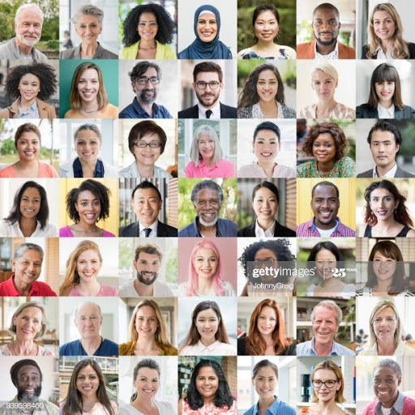
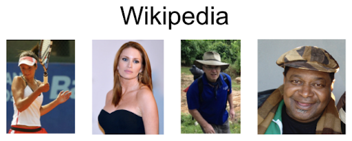

# Age, Gender and Ethnicity Detection

## Overview
You are used to unlocking your phone with a digital password, but maybe not with your face. With the advent of technology, our physical appearances can now grant access , verify payments and improve existing security systems. Facial biometrics are being used in many industries; law enforcements, healthcare, manufacturing and many more.  The ability to collect personal data has given marketers and advertisers a chance to get closer to their target markets, Face recognition algorithms allow companies to recognize certain demographics, for example, for a person is male or female, of a certain age and ethnicity, they can recommend certain products.
In this project, I explore the problem of predicting three attributes related to human face i.e Age, Gender and Ethnicity , based on the research article of computer vision group in Zurich,using transfer learning from pretrained [VGG-Face model](http://www.robots.ox.ac.uk/~vgg/software/vgg_face/) and pre-trained weights under  the path vgg_face_matconvnet/data/vgg_face.mat ,built by Oxford visual geometry group. Leveraging a pre-trained model is rather easy to get satisfying performance with deep learning solutions in Tensorflow framework.

## Main Tasks
Using Neural Network for face recognition and classification of face images in three categories; Age, Gender and Ethnicity
Using transfer learning to leverage pre-trained model to enhance Accuracy.

### Data Collection
#### Gettyimages Dataset

About 60,000 face images were scrapped from [gettyimages](https://www.gettyimages.com/editorial-images) website over 100 pages for each Ethnicity group by using a search term “human face” , setting number of people to 1 ,people composition to headshot and customizing a date range to a window before COVID-19.

#### Wikipedia Dataset

Obtained a publicly available face image dataset with 62,328 images from [here](https://data.vision.ee.ethz.ch/cvl/rrothe/imdb-wiki/) with gender and age labels for training.	 The features associated with these images are; face_location, name, gender, full_path, photo_taken, dob(date of birth).

## Data Cleaning
### Gettyimages Dataset
The following actions were taken for this dataset:
Delete images with:
- No face
- Facemasks
- Black and White Images
- More than 1 face
- Unclear face
### Wiki Dataset
The following actions were taken for this dataset.
Convert dob from Matlab serial date number format to Python datetime format.
Drop observations with:
Wrong dob
No faces (face_score = inf)
Second_face_score
Face score < 3
No gender Information
Age more than 100
Age below 0
Unnecessary columns

## Labeling
### Gettyimages Dataset
I assigned 8 classes of labels of the following Ethnicity groups:
Asian
Black
Caucasian
Hispanic/Latino
Mixed race
Multi Ethnic group
Native American
Pacific islander
### Wiki Dataset
The wiki dataset had 101 classes with age and gender labels as follows:
Age: 0 to 100
Gender: 0 for Female and 1 for Male

## Model
I used a VGG-Face pre-trained on ImageNet model with 22 layers and 37 units , that was built by [Oxford Visual Geometry Group](http://www.robots.ox.ac.uk/~vgg/publications/2015/Parkhi15/poster.pdf) and the pre-trained [weights](https://drive.google.com/file/d/1CPSeum3HpopfomUEK1gybeuIVoeJT_Eo/view) shared by the [research group](http://www.robots.ox.ac.uk/~vgg/software/vgg_face/) , however, this file is matlab compatible ,it was converted to keras by [Sefik Ilkin Serengil](https://sefiks.com/2019/07/15/how-to-convert-matlab-models-to-keras/). 

### Customized Model
The model expects a 224 * 224 * 3 input size of images and returns a (2622,) dimensional vectors as an output.  First, the model recognizes the face and then extracts the features.
The Face recognition is a combination of CNN and transfer learning. The face recognition pipeline consists of 4 stages;
Face and eye detection: This can be handled by adaboost algorithm (there is no deep learning here). Some common Computer Vision packages in Python are OpenCv and Dlib. (model uses OpenCV’s face detection in the background)
Alignment: This can easily be done if the face and eyes have been detected already. Experiments show that applying face alignment increases the accuracy of the model more than 1%. Some Math and Trigonometry is applied.
Representation: Here, the model extracts vector dimensions of face images
Verification/ Classification: Checks Eucledian distance or cosine similarity, VGG-16 model threshold for Eucleadian distance is about 0.5 and cosine similarity at 0.3. 
Since the model has a lot of layers and neurons, it would take weeks to fit , therefore i customized the model by using only the last 3 layers that focus on the face in the image and froze all the first layers . I also changed my output layer,since its a classification problem I set the output layer to be the classes instead of 2622.

Below is the model architecture of the VGG-Face model:

## Training
Gender detection:  This is a binary classification problem, therefore I applied a binary crossentropy and sigmoid activation.
Age detection: It is a multi-class classification problem and therefore i set the loss function to a categorical crossentropy and optimization algorithm is Adam, so that it converges the loss faster. I applied a softmax activation to the output.
 Ethnicity detection.  A similar setup for age detection was applied since this is also a multi-class classification problem
I created a chechpointer to monitor the model over iterations and avoid overfitting. Iterations with minimum validation loss will include the optimum weights, therefore i only save the best weights. For every Epoch, I add randomness with 256 instances(batch size) so as to avoid overfitting.

 The training process is illustrated below:

Classification type
Loss Function
Optimizer
Activation
Age
Multi-class
Categorical cross-entropy
Adam
Softmax
Gender 
Binary
Binary cross-entropy
Adam
Sigmoid
Ethnicity
Multi-class
Categorical cross-entropy
Adam
Softmax

##  Model Evaluation
The model is evaluated on the test set and the following loss and accuracy results are observed for the all the categories.

Validation loss
Accuracy
Age
3.30
0.07
Gender
0.09
0.98
Ethnicity
1.23
0.55

Age accuracy is not very intuitive.  Researchers developed an age prediction approach and converted a classification task to a regression problem,  and therefore propose that each softmax output should be multiplied with its label and the summation of the multiplications will be the age prediction.
Since accuracy is not an intuitive metric, I applied the MAE metric to see the real change in error between the predicted age and real age. I got 5.4 , so the confidence interval between the predicted and actual age is 5.4 years, the model performed really well.
For gender, as a classification problem, I calculated the precision and recall and an evaluation metric besides accuracy. My results for precision and recall were 0.979 and 0.975 respectively.

Predict Female
Predict Male
Actual Female
1283
27
Actual Male
32
3086

**Ethnicity results**

**Age results**

**Gender results**

## Further Improvements
More data to avoid unbalanced classes
Build a Multi-Output Model

